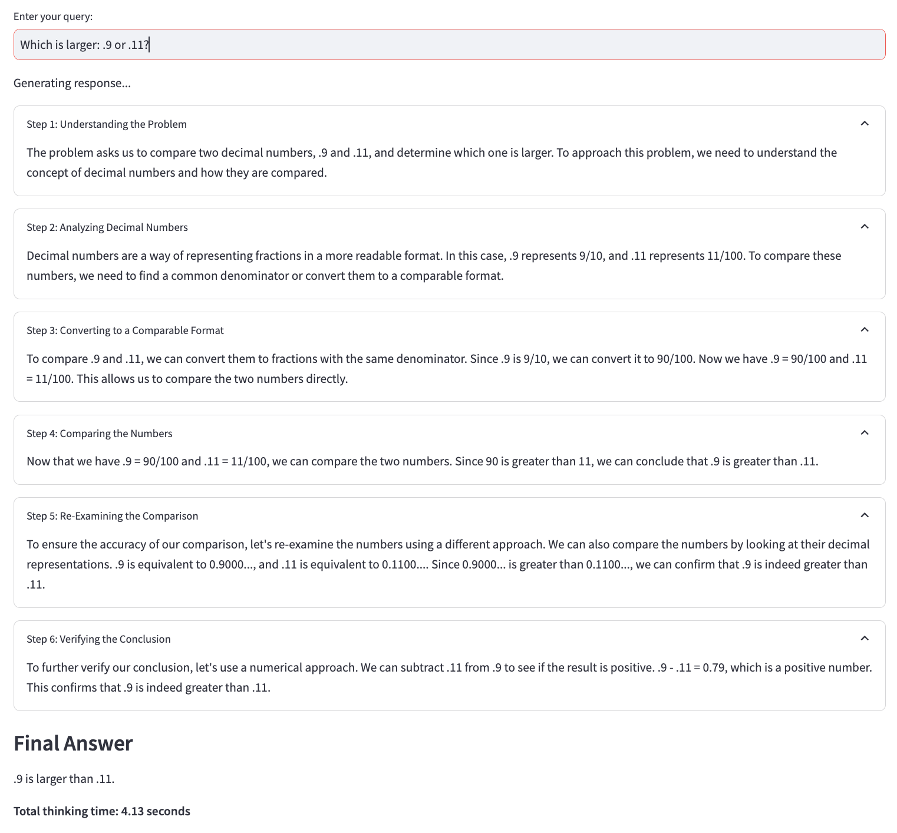

# multi1: Using multiple AI providers to create o1-like reasoning chains

***IMPORTANT: multi1 is a fork of [g1](https://github.com/bklieger-groq/g1/), made by [Benjamin Klieger](https://x.com/benjaminklieger). It was made as a way to experiment with multiple AI providers included local LLMs. All credits go to the original author.***

## Features

- [x] Using Llama-3.1 70b on Groq to create o1-like reasoning chains
- [x] Using Ollama to create o1-like reasoning chains
- [x] Using Perplexity to create o1-like reasoning chains

## Work in progress

- [ ] Add more providers
- [ ] Use something like LiteLLM to unify models code and avoid repeating code for each provider

## Original G1 Example video

[Video Demo](https://github.com/user-attachments/assets/db2a221f-f8eb-48c3-b5a7-8399c6300243)

## Description

This is an early prototype of using prompting strategies to improve the LLM's reasoning capabilities through o1-like reasoning chains. This allows the LLM to "think" and solve logical problems that usually otherwise stump leading models. Unlike o1, all the reasoning tokens are shown, and the app uses an open source model.

multi1 is experimental and being open sourced to help inspire the open source community to develop new strategies to produce o1-like reasoning. This experiment helps show the power of prompting reasoning in visualized steps, not a comparison to or full replication of o1, which uses different techniques. OpenAI's o1 is instead trained with large-scale reinforcement learning to reason using Chain of Thought, achieving state-of-the-art performance on complex PhD-level problems. 

multi1 demonstrates the potential of prompting alone to overcome straightforward LLM logic issues like the Strawberry problem, allowing existing open source models to benefit from dynamic reasoning chains and an improved interface for exploring them.


### How it works

multi1 powered by one of the supported models creates reasoning chains, in principle a dynamic Chain of Thought, that allows the LLM to "think" and solve some logical problems that usually otherwise stump leading models.

At each step, the LLM can choose to continue to another reasoning step, or provide a final answer. Each step is titled and visible to the user. The system prompt also includes tips for the LLM. There is a full explanation under Prompt Breakdown, but a few examples are asking the model to “include exploration of alternative answers” and “use at least 3 methods to derive the answer”.

The reasoning ability of the LLM is therefore improved through combining Chain-of-Thought with the requirement to try multiple methods, explore alternative answers, question previous draft solutions, and consider the LLM’s limitations. This alone, without any training, is sufficient to achieve ~70% accuracy on the Strawberry problem (n=10, "How many Rs are in strawberry?"). Without prompting, Llama-3.1-70b had 0% accuracy and ChatGPT-4o had 30% accuracy.


### Examples

> [!IMPORTANT]
> multi1 is not perfect, but it can perform significantly better than LLMs out-of-the-box. From initial testing, multi1 accurately solves simple logic problems 60-80% of the time that usually stump LLMs. However, accuracy has yet to be formally evaluated. See examples below.


##### How many Rs are in strawberry?
Prompt: How many Rs are in strawberry?

Result:


---

Prompt: Which is larger, .9 or .11?

Result:




### Quickstart

To use the launcher, follow these instructions:

1. Set up the environment:

   ```
   python3 -m venv venv
   source venv/bin/activate
   pip3 install -r requirements.txt
   ```

2. Copy the example environment file:

   ```
   cp example.env .env
   ```

3. Edit the .env file with your API keys / models preferences.

4. Run the launcher:

   ```
   python launcher.py
   ```

5. Use the arrow keys to navigate the menu, Enter to select an option, and 'q' to quit.

The launcher allows you to:

- Run the Ollama-based chat application (ol1.py)
- Run the Perplexity-based chat application (p1.py)
- Run the Groq-based chat application (g1.py)
- Edit the .env file
- Exit the launcher

When running a chat application, you can press 'q' at any time to stop the application and return to the launcher.

---

Alternatively, if you prefer to run the applications directly without the launcher:

```
streamlit run app.py
```

Where 'app.py' is the app you want to run and can be:

- g1.py (Groq)
- ol1.py (Ollama)
- p1.py (Perplexity)

---

If you prefer to use the Gradio UI, follow these additional instructions (only works with Groq at the moment):

~~~
cd gradio
~~~

~~~
pip3 install -r requirements.txt
~~~

~~~
python3 app.py
~~~


### Prompting Strategy

The prompt is as follows:

```
You are an expert AI assistant that explains your reasoning step by step. For each step, provide a title that describes what you're doing in that step, along with the content. Decide if you need another step or if you're ready to give the final answer. Respond in JSON format with 'title', 'content', and 'next_action' (either 'continue' or 'final_answer') keys. USE AS MANY REASONING STEPS AS POSSIBLE. AT LEAST 3. BE AWARE OF YOUR LIMITATIONS AS AN LLM AND WHAT YOU CAN AND CANNOT DO. IN YOUR REASONING, INCLUDE EXPLORATION OF ALTERNATIVE ANSWERS. CONSIDER YOU MAY BE WRONG, AND IF YOU ARE WRONG IN YOUR REASONING, WHERE IT WOULD BE. FULLY TEST ALL OTHER POSSIBILITIES. YOU CAN BE WRONG. WHEN YOU SAY YOU ARE RE-EXAMINING, ACTUALLY RE-EXAMINE, AND USE ANOTHER APPROACH TO DO SO. DO NOT JUST SAY YOU ARE RE-EXAMINING. USE AT LEAST 3 METHODS TO DERIVE THE ANSWER. USE BEST PRACTICES.

Example of a valid JSON response:
json
{
    "title": "Identifying Key Information",
    "content": "To begin solving this problem, we need to carefully examine the given information and identify the crucial elements that will guide our solution process. This involves...",
    "next_action": "continue"
}
```

#### Breakdown

First, a persona is added:

> You are an expert AI assistant that explains your reasoning step by step.


Then, instructions to describe the expected step-by-step reasoning process while titling each reasoning step. This includes the ability for the LLM to decide if another reasoning step is needed or if the final answer can be provided.

> For each step, provide a title that describes what you're doing in that step, along with the content. Decide if you need another step or if you're ready to give the final answer. 


JSON formatting is introduced with an example provided later.

> Respond in JSON format with 'title', 'content', and 'next_action' (either 'continue' or 'final_answer') keys. 


In all-caps to improve prompt compliance by emphesizing the importance of the instruction, a set of tips and best practices are included.

1. Use as many reasoning steps as possible. At least 3. -> This ensures the LLM actually takes the time to think first, and results usually in about 5-10 steps.
2. Be aware of your limitations as an llm and what you can and cannot do. -> This helps the LLM remember to use techniques which produce better results, like breaking "strawberry" down into individual letters before counting.
3. Include exploration of alternative answers. Consider you may be wrong, and if you are wrong in your reasoning, where it would be. -> A large part of the gains seem to come from the LLM re-evaluating its initial response to ensure it logically aligns with the problem.
4. When you say you are re-examining, actually re-examine, and use another approach to do so. Do not just say you are re-examining. -> This encourages the prevention of the LLM just saying it re-examined a problem without actually trying a new approach. 
5. Use at least 3 methods to derive the answer. -> This helps the LLM come to the right answer by trying multiple methods to derive it.
6. Use best practices. -> This is as simple as the "Do better" prompts which improve LLM code output. By telling the LLM to use best practices, or do better, it generally performs better!


> USE AS MANY REASONING STEPS AS POSSIBLE. AT LEAST 3. BE AWARE OF YOUR LIMITATIONS AS AN LLM AND WHAT YOU CAN AND CANNOT DO. IN YOUR REASONING, INCLUDE EXPLORATION OF ALTERNATIVE ANSWERS. CONSIDER YOU MAY BE WRONG, AND IF YOU ARE WRONG IN YOUR REASONING, WHERE IT WOULD BE. FULLY TEST ALL OTHER POSSIBILITIES. YOU CAN BE WRONG. WHEN YOU SAY YOU ARE RE-EXAMINING, ACTUALLY RE-EXAMINE, AND USE ANOTHER APPROACH TO DO SO. DO NOT JUST SAY YOU ARE RE-EXAMINING. USE AT LEAST 3 METHODS TO DERIVE THE ANSWER. USE BEST PRACTICES.


Finally, after the problem is added as a user message, an assistant message is loaded to provide a standardized starting point for the LLM's generation.

> Assistant: Thank you! I will now think step by step following my instructions, starting at the beginning after decomposing the problem


### Credits

g1 was originally developed by [Benjamin Klieger](https://x.com/benjaminklieger).
This multi1 fork was developed by [tcsenpai](https://github.com/tcsenpai).
